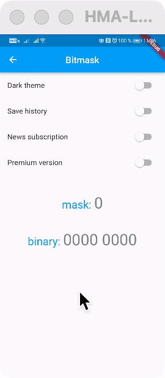
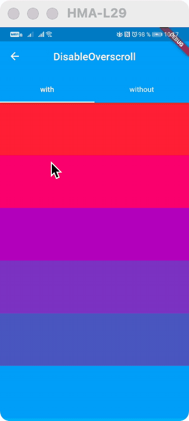

# Surf Util

[](https://github.com/surfstudio/flutter-surf-util)
[](https://app.codecov.io/gh/surfstudio/flutter-surf-util)
[](https://pub.dev/packages/surf_util)
[](https://pub.dev/packages/surf_util)
[](https://pub.dev/packages/surf_util/score)


This package is part of the [SurfGear](https://github.com/surfstudio/SurfGear) toolkit made by [Surf](https://surf.ru).

## Description

A library with set of common classes and utilities used in different modules.

### Main classes

1. [Bitmask](/lib/src/bitmask/bitmask.dart) - A generic implementation of the Bitmask type.



2. [Enum](/lib/src/enum/enum.dart) - Java-like enum.
3. [DisableOverscroll](/lib/src/ui/widget/disable_overscroll_widget.dart) - Prevent glowing when scrolling over the edge.



## Installation

Add `surf_util` to your `pubspec.yaml` file:

```yaml
dependencies:
  surf_util: $currentVersion$
```

<p>At this moment, the current version of <code>surf_util</code> is <a href="https://pub.dev/packages/surf_util"></a>.</p>

## Example

### DisableOverscroll

```dart
DisableOverscroll(
 child: ListView(
     ...
  ),
),
```

### Bitmask
```dart
class ExampleBitmask extends Bitmask {
  const ExampleBitmask zeroBit = ExampleBitmask._(1);

  const ExampleBitmask firstBit = ExampleBitmask._(2);

  const ExampleBitmask._(int value) : super(value);

  static List<ExampleBitmask> getList() {
    return [zeroBit, firstBit];
  }
}
final listBitmask = ExampleBitmask.getList();

final mask = Bitmask.getMask(listBitmask);

bool isOn = Bitmask.isOn(listBitmask.first);
```

### Enum
```dart
 class TransactionType extends Enum<String> {
   const TransactionType(String val) : super(val);

   static const TransactionType IN = TransactionType('in');
   static const TransactionType OUT = TransactionType('out');

   static TransactionType byValue(String value) {
     switch (value) {
       case 'in':
         return IN;
       case 'out':
         return OUT;
       default:
         return OUT;
     }
   }
 }
 ```

## Changelog

All notable changes to this project will be documented in [this file](./CHANGELOG.md).

## Issues

To report your issues, submit them directly in the [Issues](https://github.com/surfstudio/flutter-surf-util/issues) section.

## Contribute

If you would like to contribute to the package (e.g. by improving the documentation, fixing a bug or adding a cool new
feature), please read our [contribution guide](CONTRIBUTING.md) first and send us your pull request.

Your PRs are always welcome.

## How to reach us

Please feel free to ask any questions about this package. Join our community chat on Telegram. We speak English and
Russian.

[](https://t.me/SurfGear)

## License

[Apache License, Version 2.0](https://www.apache.org/licenses/LICENSE-2.0)
